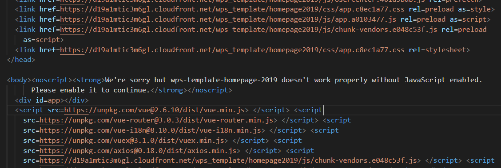
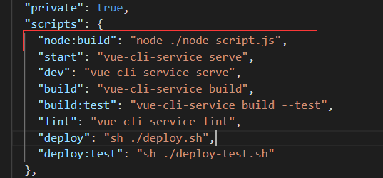
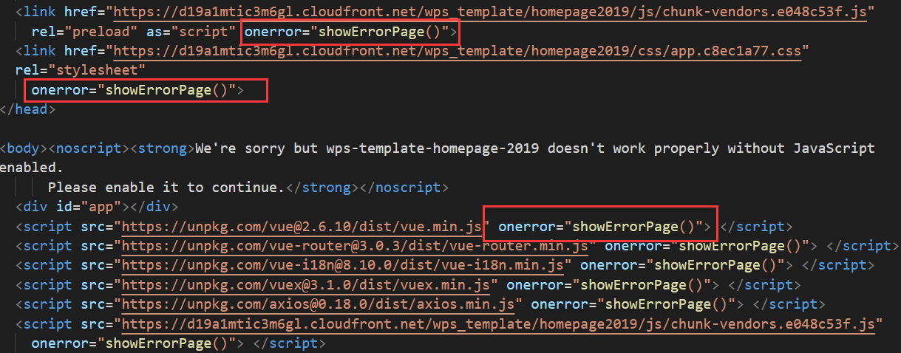

### nodejs 进行 html 的增删改查
---
##### 业务场景描述 
> 最近在做vue开发的时候，发现在网路不好的时候，cdn上的一些 css\js 资源文件回加载不出来，导致页面报错， 为了避免这种情况增加用户体验，在这中情况下，我们需要跳转到网路错误页面，这就意味着我们需要在打包好的html文件上修改代码，打包好的文件不属于编辑过程，一开始都是手动添加，每次发版打包，甚至测试环境都要手动操作一波，如果资源比较少也就认了，多的话就傻逼了，由于公司中的多个项目都是如此，于是折腾了一下，写了一段nodejs修改html文档的脚本。

- 实际开发中，当执行npm run build 的命令后，一般生成如下代码
eg: 各种 link 和 javascript 标签对一些资源的引用

当资源的引用出错的时候，我们需要提供一个onerro函数，这时候的手动改代码就有苦笑不得了，关键在于每一次都得改

- nodejs操作html文档的脚本
   [文档参考链接：https://github.com/cheeriojs/cheerio](https://github.com/cheeriojs/cheerio)

- nodejs-script.js
```js
// 注释：代码阅读之前，务必先阅读 cheerio 的文档

const fs = require('fs'); // 引入fs模块
const path = require('path'); // 引入path模块
const cheerio = require('cheerio'); // 引入第三方操作html文档的模块

// 获取文件路径（我这里的脚本放在项目的根目录下）
let filePath = path.join(path.resolve(), './dist/index.html');

// 异步读取文件
fs.readFile(filePath, { encoding: 'utf-8' }, function (err, file) {
  // readFile回调函数
  if (err) {
    throw err
  } else {
    // 读取html文件
    let $html = cheerio.load(file)
    // 获取 link 标签中没有 rel=icon 属性的标签，循环遍历添加 onerror 属性
    $html('link')
      .not('link[rel=icon]')
      .slice(0)
      .each(function (i, elem) {
        $html(this).attr('onerror', 'showErrorPage()')
      })

    // 获取 script 标签中带有 src 属性的标签，循环遍历添加onerror属性
    $html('script[src]')
      .slice(0)
      .each(function (i, elem) {
        $html(this).attr('onerror', 'showErrorPage()')
      })

    // 将修改后的文件再写入到原来的位置
    fs.writeFile(filePath, $html.html(), function (err) {
      if (err) console.log(`writeFile 失败 => ${err}`)
      else console.log(`写文件操作成功`)
    })
  }
})

```

- package.json文件中添加脚本命令，如图：

```
通过 npm run node:build 来执行脚本【改脚本必须执行在 npm run build 之后】
或者 npm run build && npm run node:build
```

###### 打包后的html文件

上面所操作的标签都添加了相应的 onerror 方法


---
分享完毕，感谢您的阅读，您的star是对我最好的尊重和鼓励