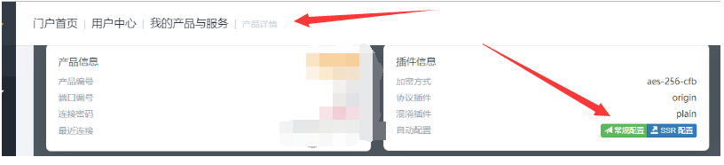
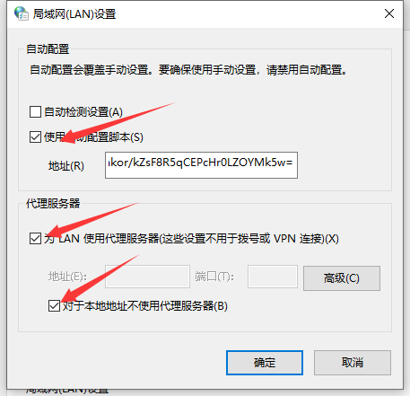

### 科学安全上网

#### 下载地址
1. [window版本(github):https://github.com/shadowsocks/shadowsocks-windows/releases](https://github.com/shadowsocks/shadowsocks-windows/releases)
2. [mac版本(官网下载地址):https://sourceforge.net/projects/shadowsocksgui/](https://sourceforge.net/projects/shadowsocksgui/)
3. [mac版本(github):https://github.com/qinyuhang/ShadowsocksX-NG-R/releases](https://github.com/qinyuhang/ShadowsocksX-NG-R/releases)

#### 安装和使用

- window上的安装
      step1: 根据实际需要选择地址进行下载，可以用上面提供的地址，也可以自行解决
      step2: 将下载下来的压缩包解压到自定义或是默认的任意目录 ： eg: 我这里安装到 E:\Shadowsocks-4.1.5 
      step3：[下载服务器的json格式的配置文件(如果自己有的话用自己的)](http://106.12.58.33:18888/) 自行注册和购买
      step4: 购买之后，如图所示，找到门户首页 =》 用户中心 =》 我的产品与服务 =》 点击常规配置

  

  将下载下来的json文件拖拽到 Shadowsocks 的安装目录，双击 .exe 文件启动
      
- mac 上的安装
      setp1、 step2、 step3 同 windows
      step4: 双击下载的应用，点击电脑右上方的图标，选择导入配置（json配置文件），或者打开服务器设定 自行添加     
      step5: 重启 Shadowsocks
       
       
#### 相关参考文档     
[mac上的shadowsocks安装和使用: https://crifan.github.io/scientific_network_summary/website/server_client_mode/ss_client/client_mac.html](https://crifan.github.io/scientific_network_summary/website/server_client_mode/ss_client/client_mac.html)

### 关于 windows 上关闭 Shadowsocks 无法上网的解决
1. 打开控制面板 =》 网络和Internet =》 网络共享中心 =》 左下角的Internet 选项 =》 顶部选择 链接 =》 下面的局域网设置
2. 取消下图中的勾勾 点击确定
